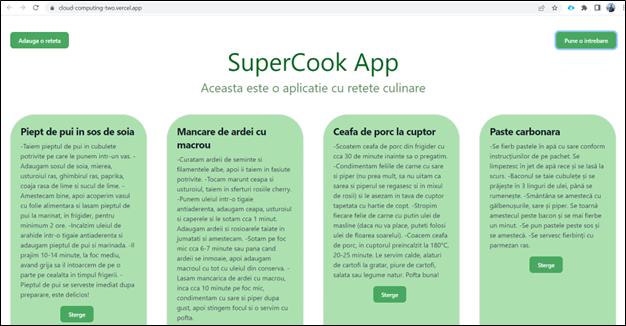
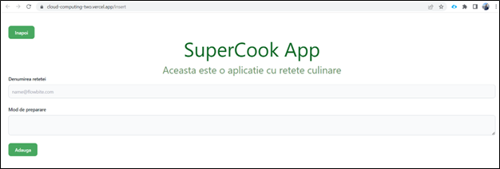
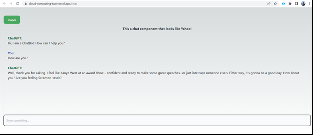

## Marineață Cristina-Ionela, 1120


-link aplicatie: https://cloud-computing-two.vercel.app/
-link video: https://youtu.be/grCqxkLSsEg


## Introducere

Aceasta aplicatie usor de folosit vine in ajutorul oamenilor care sunt la inceputul aventurii lor culinare sau a celor care isi doresc sa experimenteze noi retete interesante si delicioase. Pentru realizarea acesteia s-au utilizat trei servicii in cloud.

## Descriere problema

O aplicație web cu rețete culinare poate fi foarte utilă pentru oricine dorește să descopere și să gătească noi feluri de mâncare. Acest tip de aplicație poate avea multiple beneficii și poate fi important în mai multe feluri, printre care:

-	Inspiră și dezvoltă creativitatea în bucătărie -> O aplicație web cu rețete culinare poate ajuta utilizatorii să descopere noi feluri de mâncare, ingrediente și moduri de preparare, inspirându-i să fie mai creativi în bucătărie și să încerce lucruri noi.
-	Simplifică gătitul -> Prin furnizarea de instrucțiuni clare și pas cu pas, o astfel de aplicație poate ajuta utilizatorii să gătească mâncăruri complexe în mod simplu și eficient, reducând riscul de a face greșeli în timpul procesului de gătit.
-	Ajută la planificarea mesei -> O aplicație web cu rețete culinare poate ajuta utilizatorii să-și planifice mesele, prin furnizarea de idei pentru micul dejun, prânz, cină și gustări, în funcție de preferințe și diete.
-	Accesibilitate și diversitate -> O astfel de aplicație poate fi accesibilă oricând și oriunde, fiind disponibilă online pe dispozitive mobile sau desktop. De asemenea, poate oferi o gamă diversă de rețete, potrivite pentru diferite diete și preferințe alimentare.

## Descriere API

•	MongoDB

MongoDB Atlas Data API este un serviciu administrat care vă permite să lucrați în siguranță cu datele stocate în Atlas folosind cereri HTTPS standard. Data API nu este o conexiune directă la baza dvs. de date. În schimb, API este un serviciu middleware complet gestionat care se află între clusterul dvs. și clienții care trimit cereri.
Se poate utiliza Data API pentru conectarea la MongoDB Atlas de pe orice platformă care acceptă HTTPS, inclusiv:
- browsere web
- Servere web
- conducte CI/CD
- Medii de calcul fără server și Edge
- Aplicații mobile
- Dispozitive de tip Internet-of-Things

•	Vercel 

Vercel REST API permite dezvoltatorilor să interacționeze în mod programatic cu contul și serviciile Vercel folosind cereri HTTP.
Cu ajutorul API, dezvoltatorii pot implementa noi versiuni ale aplicațiilor web, pot gestiona domenii personalizate, pot prelua informații despre implementări și pot gestiona secrete și variabile de mediu pentru proiecte.
API-ul acceptă orice limbaj de programare sau cadru care poate trimite cereri HTTP

•	ChatGTP

GPT (Generative Pre-trained Transformer) de la OpenAI este o arhitectură de rețea neuronală de mari dimensiuni care a fost antrenată pe cantități mari de date de text și care poate genera text asemănător cu cel uman. Arhitectura GPT a evoluat de-a lungul timpului, iar cea mai recentă versiune este GPT-3, care a fost antrenată pe un set de date masiv de peste 45 de terabytes de date text.
OpenAI oferă o interfață de programare a aplicațiilor (API) numită GPT-3 API, care permite dezvoltatorilor să acceseze puterea modelului de limbaj GPT-3 din aplicațiile lor. GPT-3 API poate fi utilizat pentru a genera text într-o varietate de contexte, cum ar fi chatbots, sisteme de răspuns la întrebări, traducere de limbi străine, creare de conținut și multe altele.
Pentru a utiliza GPT-3 API, dezvoltatorii trebuie să se înregistreze pentru o cheie API și apoi să integreze API în aplicațiile lor utilizând SDK-urile (Software Development Kits) și API-urile furnizate. GPT-3 API este un instrument puternic care poate ajuta dezvoltatorii să creeze interfețe conversaționale inteligente și asemănătoare cu cele umane și să genereze conținut de înaltă calitate cu o intervenție umană minimă.


## Capturi de ecran


<br>
Pagina principala in care sunt afisate retetele din baza de date. Dupa cum se poate observa exista 3 butoane.
-Butonul “Adauga o reteta” -> face legatura cu o alta pagina, in care se pot introduce retete in baza de date
-Butonul “Pune o intrebare” -> face legatura cu o alta pagina, in care se pot pune intrebari la care se va raspunde cu ajutorul inteligentei artificiale
-Butonul “Sterge” ->sterge respective reta din baza de date


<br>
In aceasta pagina se pot introduce retet in baza de date, care ulterior vor fi afisate in pagina principala. Exista 2 textboxes in care se introduce date despre reta. Se incepe cu introducerea denumirii retetei, ulterior in a doua caseta se introduce instructiuni despre modul de preparare. La final se apasa pe butonul “Adauga”, iar astfel se va adauga reteta in baza de date.
Dupa cum se poate observa exista in partea stanga sus un buton “Inapoi” care face legatura cu pagina principala.



<br>
In aceasta pagina este present chatbot-ul Chat GTP, care raspunde cu usurinta prin inteligenta artificiala la intrebarile adresate de utilizatori.
Ca si in pagina anterioara, exista in stanga sus butonul “Inapoi” care face legatura cu pagina principala.


## Referinte

```bash
https://gurita-alexandru.gitbook.io/cloud-computing-2023-simpre/
https://github.com/guritaalexandru/cc-next-2
https://ro.wikipedia.org/wiki/ChatGPT
https://vercel.com/docs/rest-api
```

